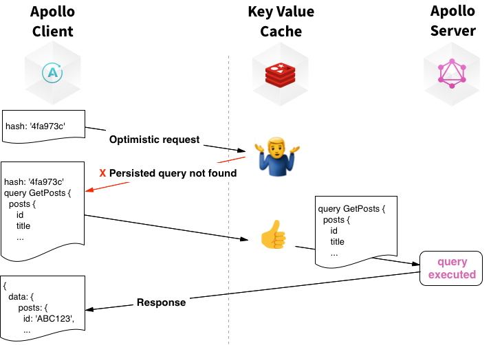
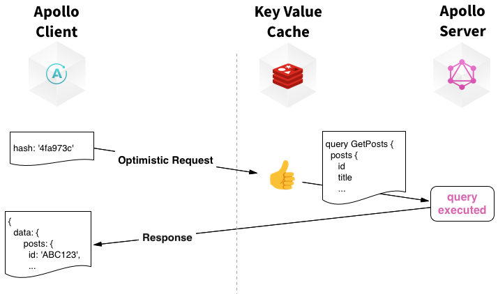

### Automatic Persisted Queries

`Apollo Server`는 처음 발견한 쿼리를 `Redis` 또는 `Memcached`에 저장하고, 해싱을 통해 각 쿼리에 `고유 식별자`를 부여할 수 있습니다. 클라이언트는 이것을 이용하여 다음에는 `더 짧은 요청문`을 날릴 수 있게되어, 네트워크 비용을 줄일 수 있습니다.

<br/>

##### 처음 쿼리를 발견한 경우 :

<br>



<br/>

##### 캐싱된 쿼리를 사용 :



<br/>

이 기능을 사용하려면 서버측에 캐시 저장소를 붙여야합니다.

```ts
export const server = new ApolloServer({
    schema,
    persistedQueries: {
        //
        // With Redis
        cache: new RedisCache({
            host: "localhost",
            port: 6379,
        }),

        //
        // With Memcached
        // cache: new MemcachedCache(["localhost"]),
    },
});
```

---

### Via HTTP

직접 `HTTP Request`를 날려서 `Persist Query`를 사용해보겠습니다. 먼저 아래의 쿼리를 `Persist Query`로 가져오려면 쿼리 문자열을 해싱하는 과정이 필요합니다.

```graphql
{
    __type
}
```

위의 쿼리 문자열을 해싱하면 `ecf4edb46db40b5132295c0291d62fb65d6759a9eedfa4d5d612dd5ec54a6b38`을 얻을 수 있습니다.

<br/>

이제 위에서 만들어진 해쉬값을 사용하여 `GET` 요청을 날릴 수 있습니다. 그러나 이번이 처음 쿼리를 호출하는 것이므로, 서버측에서는 이에 대응되는 쿼리를 발견하지 못하므로 `PersistedQueryNotFound` 에러가 반환됩니다.

##### request :

```bash
curl -g 'http://localhost:4000/?extensions={"persistedQuery":{"version":1,"sha256Hash":"ecf4edb46db40b5132295c0291d62fb65d6759a9eedfa4d5d612dd5ec54a6b38"}}'
```

##### response :

```json
{
    "errors": [
        {
            "message": "PersistedQueryNotFound",
            "extensions": {
                "code": "PERSISTED_QUERY_NOT_FOUND",
                "exception": {
                    "stacktrace": []
                }
            }
        }
    ]
}
```

<br/>

`PersistedQueryNotFound` 에러를 받은 클라이언트는 쿼리 문자열까지 붙여서 다시 요청해야 합니다. 서버측은 해당 쿼리를 실행하고 `sah256Hash`으로 일정 시간동안 캐싱합니다.

##### request :

```bash
curl -g 'http://localhost:4000/?query={__typename}&extensions={"persistedQuery":{"version":1,"sha256Hash":"ecf4edb46db40b5132295c0291d62fb65d6759a9eedfa4d5d612dd5ec54a6b38"}}'
```

##### response :

```json
{
    "data": {
        "__typename": "Query"
    }
}
```

##### redis:

```bash
127.0.0.1:6379> keys *
1) apq:ecf4edb46db40b5132295c0291d62fb65d6759a9eedfa4d5d612dd5ec54a6b38

127.0.0.1:6379> get apq:ecf4edb46db40b5132295c0291d62fb65d6759a9eedfa4d5d612dd5ec54a6b38
{__typename}
```

<br/>

이제 해시키으로만 요청을 해도 결과가 반환됩니다.

##### request :

```bash
curl -g 'http://localhost:4000/?extensions={"persistedQuery":{"version":1,"sha256Hash":"ecf4edb46db40b5132295c0291d62fb65d6759a9eedfa4d5d612dd5ec54a6b38"}}'
```

##### response :

```json
{
    "data": {
        "__typename": "Query"
    }
}
```

---

### Via Apollo-Client

`apollo-link-persisted-queries`를 사용하면 모든 쿼리에 이 기능을 적용할 수 있습니다.

```ts
import { createPersistedQueryLink } from "apollo-link-persisted-queries";
import { createHttpLink } from "apollo-link-http";
import { InMemoryCache } from "apollo-cache-inmemory";
import { gql } from "apollo-boost";
import ApolloClient from "apollo-client";
import "cross-fetch/polyfill";

async function main() {
    const link = createPersistedQueryLink().concat(
        createHttpLink({ uri: "http://localhost:4000" })
    );

    const client = new ApolloClient({
        cache: new InMemoryCache(),
        link: link,
    });

    const r = await client.query({
        query: gql`
            query {
                fibonacci(n: 4)
            }
        `,
    });
    console.log(r.data);
}
main();
```
