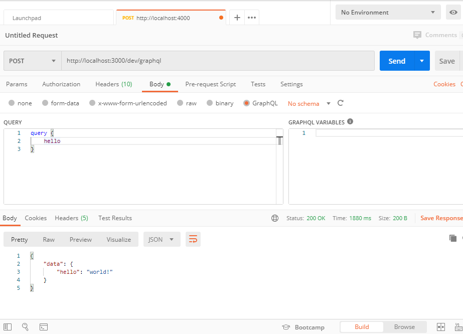
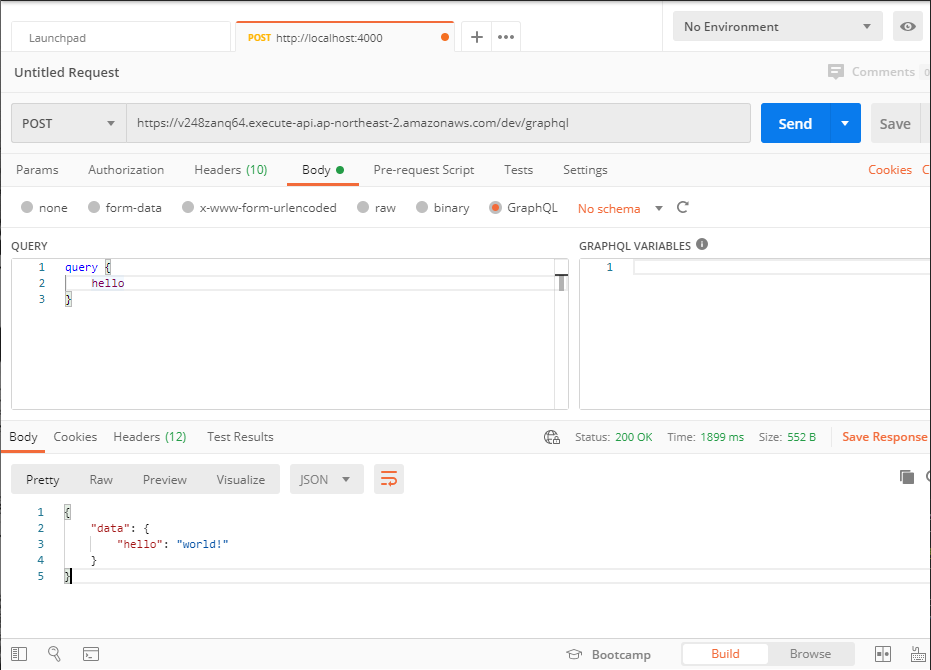

### Deploy to AWS Lambda

`serverless` 프레임워크와 `apollo-server-lambda`를 사용하면 `GraphQL`서버를 서버리스하게 배포할 수 있습니다.

<br/>

#### 필수 패키지 설치

먼저 필요한 패키지부터 설치하겠습니다.

```bash
npm install apollo-server-lambda
npm install serverless -D
```

<br/>

타입스크립트에서 작성한 코드를 배포하기 위해 `serverless-plugin-typescript`와 오프라인 테스팅을 위한 `serverless-offline` 플러그인도 같이 설치합니다.

```bash
npm install serverless-plugin-typescript serverless-offline -D
```

<br/>

#### 핸들링 객체 생성하기

먼저 평범하게 리졸버를 작성한 뒤.

```ts
import { Resolver, Query, buildSchemaSync } from "type-graphql";

@Resolver()
class HelloResolver {
    @Query(() => String)
    hello(): string {
        return "world!";
    }
}
```

<br/>

`apollo-server-lambda`를 통해 `ApolloServer`를 생성하고 외부에 노출시킵니다.

```ts
import { buildSchemaSync } from "type-graphql";
import { ApolloServer } from "apollo-server-lambda";

const schema = buildSchemaSync({ resolvers: [HelloResolver] });

export const handler = new ApolloServer({ schema });
```

<br/>

#### 서버리스 설정파일 작성하기

`serverless.yml`을 작성하고 프로젝트 루트에 위치시킵니다. 플러그인 부분에서 `serverless-plugin-typescript`가 `serverless-offline`보다 위에 있어야 함에 주의해주세요.

```yml
#
# 람다함수 이름
service: study-graphql-server

#
# AWS 람다 스펙
provider:
    runtime: nodejs12.x
    name: aws
    stage: dev
    region: ap-northeast-2
    memorySize: 128
    timeout: 5

#
# 핸들러 경로와, 해당 핸들러를 노출시킬 경로.
functions:
    main:
        handler: src/26/index.handler
        events:
            - http:
                  path: /graphql
                  method: post

#
# 플러그인 부분
plugins:
    - serverless-plugin-typescript
    - serverless-offline
```

<br/>

#### 오프라인 환경에서 실행

다음 명령어로 로컬환경에서 람다를 테스트할 수 있습니다.

```bash
npx sls offline
```

<br/>

예제와 똑같이 했다면 `/dev/graphql`에 `ApolloServer`가 노출되어 있을것입니다. `Postman`같은 프로그램을 사용하여 `GQL`을 보내보세요.



<br/>

#### AWS 람다에 배포

다음 명령어로 람다에 배포할 수 있습니다.

```bash
npx sls deploy
```

<br/>

콘솔에 출력된 `endpoint`에 `ApolloServer`가 노출되어 있을것입니다. `Postman`같은 프로그램을 사용하여 `GQL`을 보내보세요.



<br/>

배포된 람다함수를 제거하려면 다음 명령어를 입력해주세요.

```bash
npx sls remove
```
